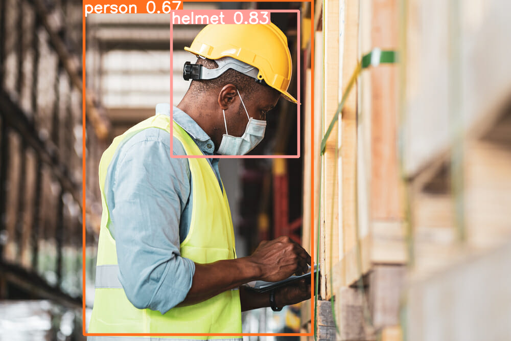

# Helmet_Safety_Detection

## Introduction
This project uses the YOLOv10 to detect whether people are wearing helmets in images

## How to install?
1. Clone the repository
```sh
git clone https://github.com/Kuuhakuu001/Helmet_Safety_Detection.git

cd Helmet_Safety_Detection
```

2. Setup Google Colab:
- Open Google colab and login
- Upload Helmet_Safety_Detection.ipynb
- Change the run time from CPU to GPU
3. Install the prerequisites
- Install all the dependencies in requirements.txt
- Follow the .ipynb file to run project

## Run the Project
- The predicted image:
